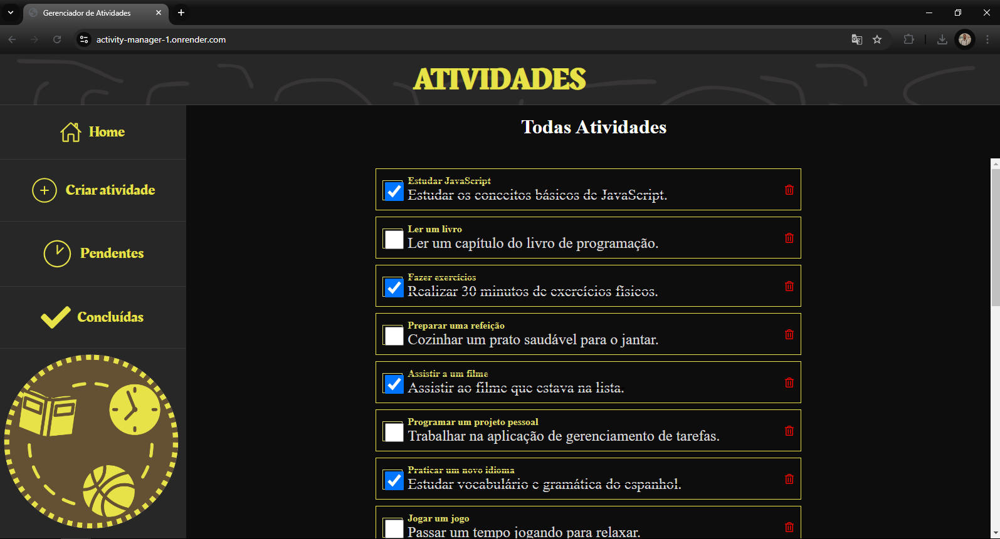
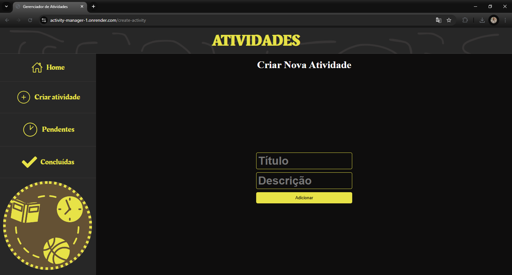
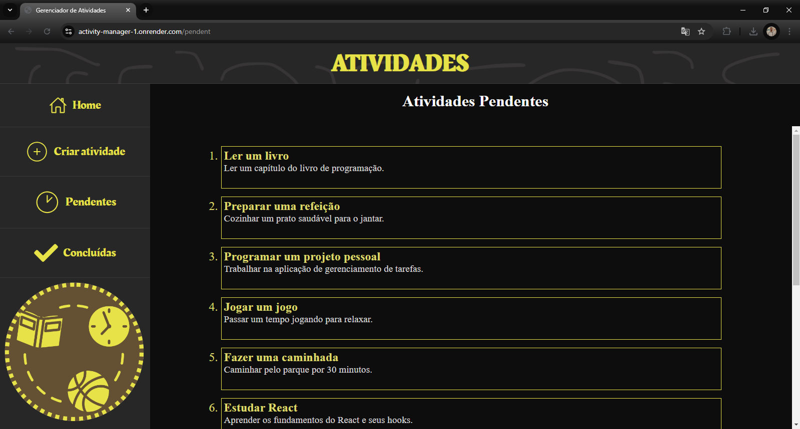
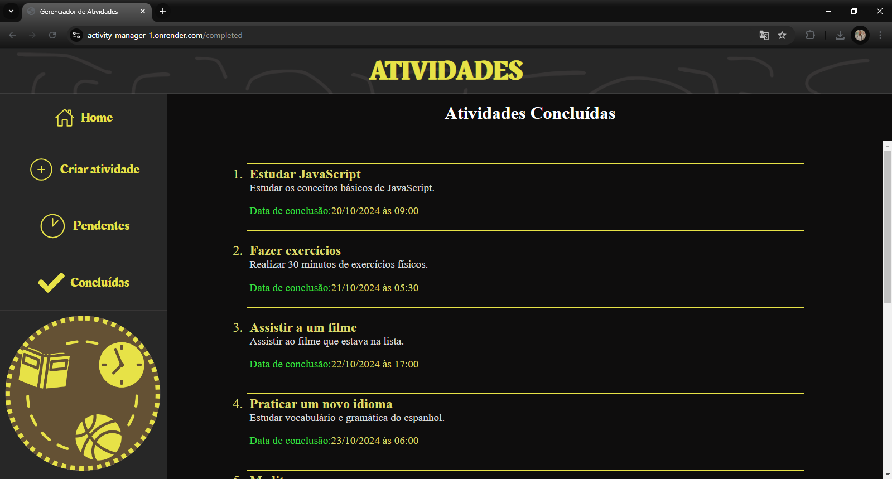

  

# Descrição

O projeto é um gerenciador de atividades, que permite criar e visualizar tarefas, além de permitir também uma visualização de quando e quais atividades já foram concluídas e atividades pendentes.  

# Instalação - Dev Environment

Para executar em ambiente de desenvolvimento, os seguintes passos devem ser seguidos:  
1. **Obter repositório do github:**  
``git clone https://github.com/Andre-Vlt/activity-manager.git``  
2. **Instalar dependências:**  
``npm install``  
3. **Alterar o json-server para localhost:**  
A url base para o json-server encontra-se em **src/api.ts**, basta alterá-la para:  
``baseURL: "localhost:3000"``
4. **Inicializar json-server:**  
``npm run json-server``  
5. **Executar projeto**  
``npm run dev``
6. **Acessar projeto:**  
Para acessar e testar o app, basta utilizar o navegador para acessar a ***localhost:5173***, que é onde o projeto roda em ambiente de desenvolvimento.

# Testar sem instalar

Existe um deploy do projeto no render. O link de acesso para o mesmo é:  
https://activity-manager-1.onrender.com/  
No site é possível realizar todas as operações (criar, excluir e visualizar atividades).

# Demonstração de uso  

Em Home, as atividades presentes no banco de dados aparecem, e o usuário tem a possibilidade de marcá-las como concluídas ou deletá-las:  
  
Para criar novas atividades, basta selecionar a opção no menu lateral, inserir o título e a descrição da atividade desejada e clicar no botão para adicionar a nova atividade:
  
Atividades ainda não concluídas podem ser visualizadas na aba "Pendentes":  
  
Atividades já concluídas são mostradas na aba "Concluídas" juntas da data e hora de de sua conclusão:  

# Tecnologias utilizadas

-  Vite
-  TypeScript
-  React
-  JSON Server
-  Node.JS  
